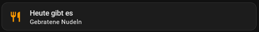

# Home Assistant Setup Guide

Everything needed to wire this repo's recipe list into a Home Assistant dashboard: a poller for the data, a sensor that remembers the current pick (and avoids repeating recent ones), the script that does the picking, and a dashboard card.

## Prerequisites

- Home Assistant Core/OS with YAML config access (`configuration.yaml`, `scripts.yaml`).
- For the card shown below: [HACS](https://hacs.xyz/) + the [Mushroom](https://github.com/piitaya/lovelace-mushroom) card set. A built-in alternative with no custom-card dependency is included further down.

## 1. Poll the recipe list

Add a `rest:` resource (merge into an existing `rest:` block if you already have one — it's a list):

```yaml
rest:
  - resource: https://raw.githubusercontent.com/ftrauernicht/ha-dashboard-recipes/main/recipes/recipes.json
    scan_interval: 3600 # raw.githubusercontent.com is CDN-cached for a few minutes; polling more often has no effect
    sensor:
      - name: "Dish List"
        unique_id: dish_list
        value_template: "loaded"
        json_attributes:
          - recipes
```

This creates `sensor.dish_list` with a `recipes` attribute: a list of `{id, name, description}` objects (see the [main README](../README.md) for the schema).

> If an entity with the same `unique_id`/entity_id already exists from a previous setup, Home Assistant will suffix the new one (`sensor.dish_list_2`). Rename it back via **Settings → Devices & Services → Entities**, or just use whatever id Home Assistant assigns and adjust the script below accordingly.

## 2. A sensor that remembers the current pick

Rather than a generic `input_text` helper, a trigger-based template sensor holds the picked dish's full data (not just its name) and keeps a short history to avoid repeats:

```yaml
template:
  - trigger:
      - platform: event
        event_type: dish_drawn
    sensor:
      - name: "Current Dish"
        unique_id: current_dish
        icon: mdi:silverware-fork-knife
        state: "{{ trigger.event.data.name }}"
        attributes:
          id: "{{ trigger.event.data.id }}"
          description: "{{ trigger.event.data.description }}"
          # Last 5 picked ids, so the script can avoid short-term repeats
          # (not just "different from the very last pick").
          recent_ids: >
            
            {{ (previous + [trigger.event.data.id])[-5:] }}
```

This gives you `sensor.current_dish`: its state is the dish name, and it carries `id`, `description`, and `recent_ids` as attributes. Trigger-based template sensors restore their last state across a Home Assistant restart, so the history survives restarts too.

## 3. The picking script

```yaml
pick_random_dish:
  alias: Pick a random dish
  sequence:
    - variables:
        all_dishes: "{{ state_attr('sensor.dish_list', 'recipes') | default([], true) }}"
        recent_ids: "{{ state_attr('sensor.current_dish', 'recent_ids') | default([], true) }}"
    - variables:
        candidates: " {{ c if c | length > 0 else all_dishes }}"
    - variables:
        picked: "{{ candidates | random }}"
    - event: dish_drawn
      event_data:
        id: "{{ picked.id }}"
        name: "{{ picked.name }}"
        description: "{{ picked.description | default('') }}"
```

Notes:

- `state_attr()` returns Python `None` (not Jinja `Undefined`) when an attribute doesn't exist yet — `default([], true)` is required; the plain `default([])` only replaces `Undefined` and would let `None` slip through and break the next filter.
- The "avoid the last 5" window is a size trade-off: too small and you'll get near-repeats; too large and (for a short list) you may run out of candidates and always fall back to the full list. Adjust `[-5:]` in step 2 to taste.
- Add this under the `script:` domain in `scripts.yaml`, or paste it as a new script via the UI (Settings → Automations & Scenes → Scripts → Edit in YAML).

## 4. The dashboard card

Requires the [Mushroom](https://github.com/piitaya/lovelace-mushroom) custom card (via HACS):

```yaml
type: custom:mushroom-template-card
primary: "Today's dish"
secondary: "{{ states('sensor.current_dish') }}"
icon: mdi:silverware-fork-knife
icon_color: orange
layout: horizontal
entity: sensor.current_dish
tap_action:
  action: call-service
  service: script.pick_random_dish
hold_action:
  action: more-info
```

Tapping the card picks a new dish; holding it opens the entity's more-info dialog, which also lists `description` once you start filling that in for entries in `recipes.json`.



### Alternative card (no HACS dependency)

A built-in `tile` card gets most of the way there without any custom cards, at the cost of a slightly less compact layout:

```yaml
type: tile
entity: sensor.current_dish
name: "Today's dish"
icon: mdi:silverware-fork-knife
tap_action:
  action: call-service
  service: script.pick_random_dish
```

## 5. Apply without a restart

After editing `configuration.yaml` / `scripts.yaml`:

1. **Developer Tools → YAML → Check Configuration** (or `POST /api/config/core/check_config`).
2. Reload the affected domains individually — no full restart needed:
   - **Developer Tools → YAML → REST**, or call the `rest.reload` service
   - **Developer Tools → YAML → Template Entities**, or call the `template.reload` service
   - **Developer Tools → YAML → Scripts**, or call the `script.reload` service

## Customizing

- Point step 1's `resource:` at your own fork if you want to maintain your own dish list instead of contributing to this one.
- `description` isn't rendered by the example card above — it's reserved for a future/your own detail view (e.g. swap `hold_action` for a custom popup, or add a `secondary_info` line elsewhere).
- Change the number `5` in step 2's `recent_ids` template to widen or shrink the no-repeat window.
